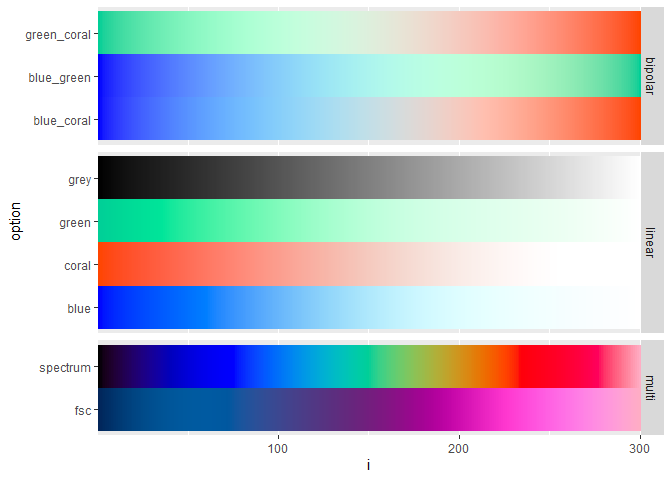
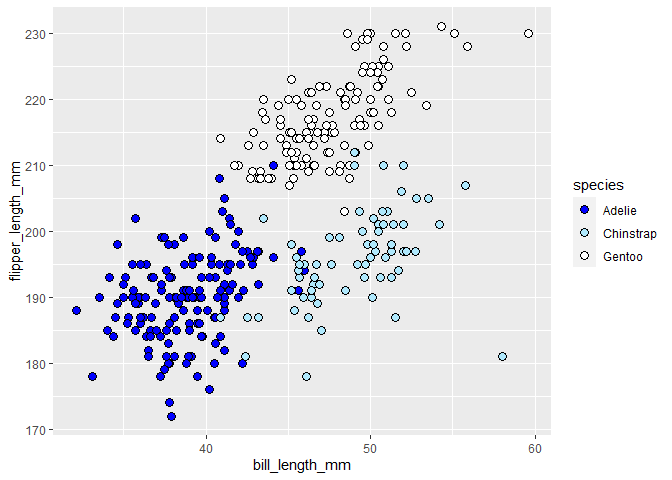
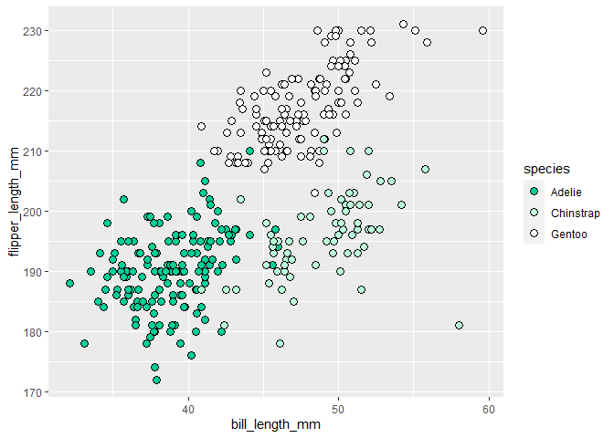
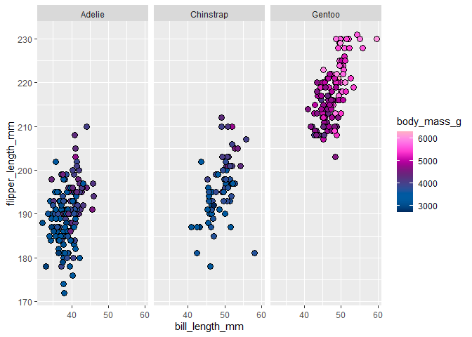

<!-- README.md is generated from README.Rmd. Please edit that file -->

# bpscales

<!-- badges: start -->

[](https://github.com/context-dependent/bpscales/actions/workflows/R-CMD-check.yaml)
<!-- badges: end -->

`bpscales` provides Blueprint-branded colour palettes for general
applications and scales for specific application to ggplot2 plots.

## Installation

You can install the development version of bpscales from
[GitHub](https://github.com/) with:

``` r
# install.packages("devtools")
devtools::install_github("context-dependent/bpscales")
```

## Palettes

The available palettes are categorized by two parameters: `type` and
`option`.

``` r
library(bpscales)

show_blueprint_palettes()
```



## Discrete Data

> **Penguins:** The examples below use data from the
> [`palmerpenguins`](https://allisonhorst.github.io/palmerpenguins/)
> package, developed by Horst, Hill, and Gorman as an alternative to the
> `iris` dataset, which is [old, boring, and built by
> eugenicists](https://armchairecology.blog/iris-dataset/).

``` r
library(bpscales)
library(palmerpenguins)
library(ggplot2)
## basic example code

penguins |>
  ggplot(aes(bill_length_mm, flipper_length_mm)) +
  geom_point(aes(fill = species), shape = 21, size = 3) +
  scale_fill_blueprint(discrete = TRUE)
#> Warning: Removed 2 rows containing missing values (`geom_point()`).
```



``` r
penguins |>
  ggplot(aes(bill_length_mm, flipper_length_mm)) +
  geom_point(aes(fill = species), shape = 21, size = 3) +
  scale_fill_blueprint(type = "linear", option = "green", discrete = TRUE)
#> Warning: Removed 2 rows containing missing values (`geom_point()`).
```



## Continuous Data

``` r
penguins |>
  ggplot(aes(bill_length_mm, flipper_length_mm)) +
  facet_wrap(~species, nrow = 1) +
  geom_point(aes(fill = body_mass_g), shape = 21, size = 3) +
  scale_fill_blueprint(type = "multi", option = "fsc")
#> Warning: Removed 2 rows containing missing values (`geom_point()`).
```


